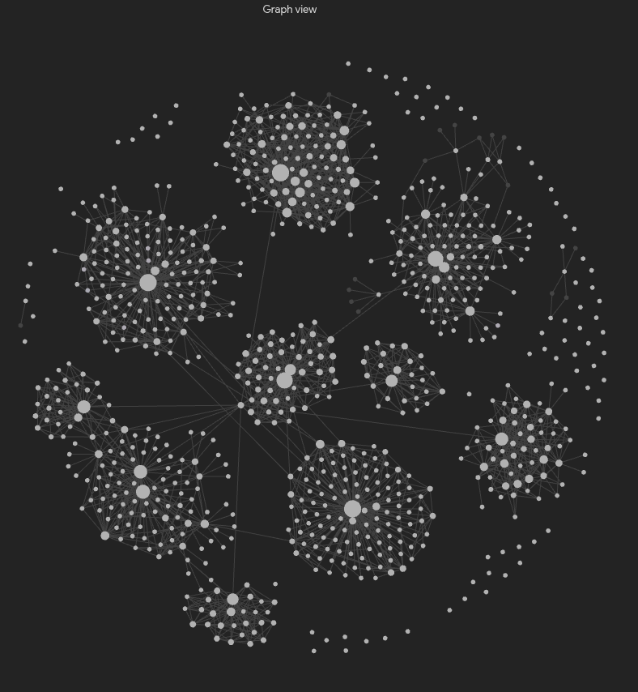

# LLM Wiki

A personal knowledge base that writes itself — mostly. Everything goes in: work, daily life, school, university, projects, ideas, home. Over years. An LLM agent (Claude Code, Ollama, whatever you point at it) turns raw dumps into a clean, cross-linked wiki. You review and occasionally redirect — this isn't meant to run fully unsupervised.

It's [Karpathy's "LLM wiki" idea](https://gist.github.com/karpathy/442a6bf555914893e9891c11519de94f), extended for one person's entire life instead of one topic: life-areas (arbeit, alltag, schule, studium, projekte, ideen, home) organize domains, domains hold the actual synthesized knowledge, and a shared/ layer stops the same concept getting reinvented in three different places.

## Table of contents
- [Setup](#setup)
- [Workflow & Best Practices](#workflow--best-practices)
- [Why this shape](#why-this-shape)
- [Do you need Graphify or a graph database for this?](#do-you-need-graphify-or-a-graph-database-for-this)
- [Spinning up a new domain](#spinning-up-a-new-domain)
- [Study notes](#study-notes)
- [Verified sources](#verified-sources)
- [Day to day](#day-to-day)
- [Archiving](#archiving)
- [Forking](#forking)
- [License](#license)

## Setup 
1. Clone the repo
2. Run `./scripts/install-hooks.sh` once — this protects raw/ from accidental edits going forward.
3. Drop a few files into `raw/inbox/`
4. Open Claude Code in the folder, type `/process-inbox`
5. Read the summary, skim what it created under `wiki/domains/`
6. Repeat whenever you have new material

## Workflow & Best Practices

**What this actually is, in one sentence:** you dump stuff in, an AI reads it and writes clean notes about it, and those notes are what you (or anything else) actually reads later — never the original dump.

**Two ways to add something, pick whichever fits:**

1. **I don't know where this goes / I just want it filed** — drop the file into `raw/inbox/`, open Claude Code in this repo, type `/process-inbox`, wait. It converts PDFs/scans, figures out the right topic, files it, and gives you a plain-language summary of what it did. This is the default for most people, most of the time.
2. **I already know exactly where this belongs** — put the file(s) directly at `raw/<life-area>/<domain>/`, then tell Claude Code either:
   - a single file: "ingest raw/<life-area>/<domain>/filename.md", or
   - a whole folder at once: "ingest raw/<life-area>/<domain>/" — Claude processes everything new in there in one go, and automatically skips anything already ingested, so it's safe to drop more files in later and re-run the same instruction on the same folder.

**Best practices:**
- Batch things that belong together before running `/process-inbox` — ten related PDFs process better in one pass than being ingested one at a time across separate sessions, because the agent can see the pattern between them.
- Don't dump years of backlog in one go. A session that tries to process hundreds of files at once loses accuracy. Do it in chunks — a semester, a project, a month — and run `/process-inbox` again for the next chunk.
- Check in on `wiki/index.md` and a domain's `overview.md` every so often. This system drifts if nobody ever looks at what it produced, same as any note-taking habit.
- Ignore `verified: no` on sources until you have a reason to check — it's the default, not a warning. Only flip it to `verified: yes` yourself, after actually comparing the wiki page to the original source.
- When a course, project, or topic is genuinely done, ask Claude Code to archive that domain — it moves out of the way but nothing you learned from it disappears.
- Run `/wiki-audit` every so often — quarterly, or before a big new import batch — to catch orphaned pages, dead links, and duplicates that slipped past the per-ingest checks. It only writes a report, never changes anything on its own.
- Hierarchical tags and domain-overview backlinks are enforced automatically on every commit (scripts/validate-wiki.py runs via the pre-commit hook) — you never need to check this by hand, and it can't drift silently.

**The mental model, in three lines:**
- `raw/` = a filing cabinet you never open again once something's inside.
- `wiki/` = the actual notes — this is what gets read, searched, or fed to an AI assistant later.
- `wiki/index.md` = the table of contents for all of it.

scripts/convert-pdf.sh still exists as an optional manual utility for bulk pre-conversion outside a Claude Code session, but it's no longer a required step — the agent converts files itself during both ingest paths now.

## Why this shape
- raw/ is where everything lands first — chat exports, session logs, clipped articles, converted lecture PDFs. Nothing here ever gets touched again. It's the source of truth you can always point back to.
- wiki/domains/<life-area>/<name>/ is the actual knowledge — synthesized, deduplicated, current. This is what you (or a RAG pipeline) actually query.
- wiki/shared/concepts/ holds anything that shows up in more than one domain, so "normalization" learned in a database class and reused years later in a project is one page, not two.
- AGENTS.md is the only file that controls how the agent behaves. Want it pickier about creating new pages, or handling lernzettel differently? Edit a sentence in there. No config, no redeploy.

## Do you need Graphify or a graph database for this?
No, not to start. Tags, Obsidian backlinks, and the shared-concepts rule in AGENTS.md are the connection mechanism, and they're enough for a single-person wiki growing gradually. A separate graph-extraction pass (Graphify or similar) is worth adding later as a periodic audit — "find connections I forgot to make manually" — not as a day-one requirement.

## Spinning up a new domain
1. Copy wiki/domains/_template/ to wiki/domains/<life-area>/<your-topic>/ (life-area must be one of: work, everyday life, school, studies, projects, ideas, home)
2. Fill in overview.md with a paragraph on what this domain even is
3. Add it to "Active domains" in wiki/index.md
4. Start dropping raw material into raw/ — the agent figures out which domain it belongs to

## Study notes
For anything exam-driven (school, uni, certifications), ask the agent to build or update a study note for a domain once its concepts are populated. It's a condensed, bullet-point distillation of the concepts — not a new synthesis — so it's only ever as good as the concept pages underneath it.

## Verified sources
Every wiki page ends in a Sources section, one line per raw citation, each marked verified: yes or verified: no. The agent only ever writes no. Flipping it to yes is a manual step — you checked the wiki page against the actual raw source and confirmed it's accurate. Treat unverified pages as "probably right, not yet checked."

## Day to day
Two options, same as above: drop into raw/inbox/ and run /process-inbox for anything you haven't sorted yourself, or place a file directly under raw/<life-area>/<domain>/ and tell the agent to ingest that specific path if you already know where it goes. Either way it writes a source summary, updates or creates entities/concepts (checking shared/ first), updates the lernzettel if relevant, and logs everything.

## Archiving
When a domain is done (course finished, project closed), move it to wiki/domains/archive/<life-area>/<name>/. Anything it pulled into wiki/shared/concepts/ stays active — you don't lose reusable knowledge just because the course ended.

## Forking
At this scope you probably won't need to fork often — one repo covers your whole life via domains/. Fork only for something that needs genuinely separate handling (e.g. a work wiki you might eventually hand off to an employer, with different sharing/privacy rules than the rest).

---
## License

See [LICENSE](./LICENSE).

--- 

&copy; [lpj.app](https://github.com/lpj-app), idea by [Andrej karpathy](https://gist.github.com/karpathy). Licensed under MIT.